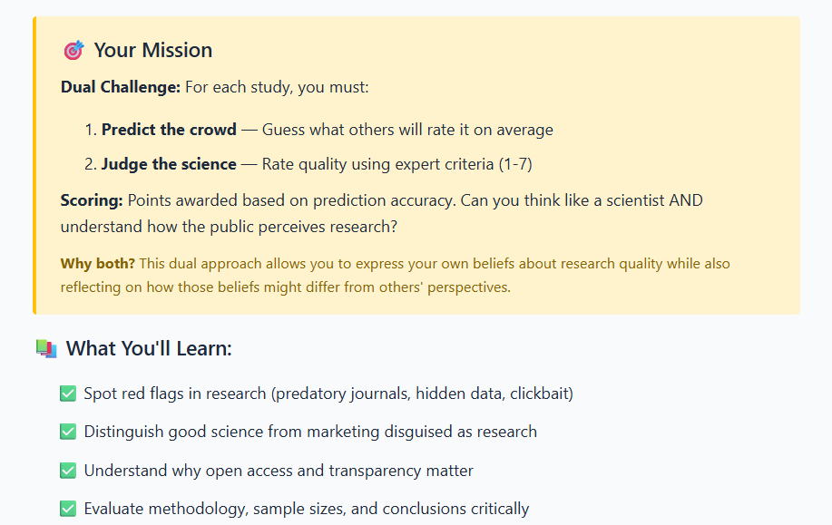
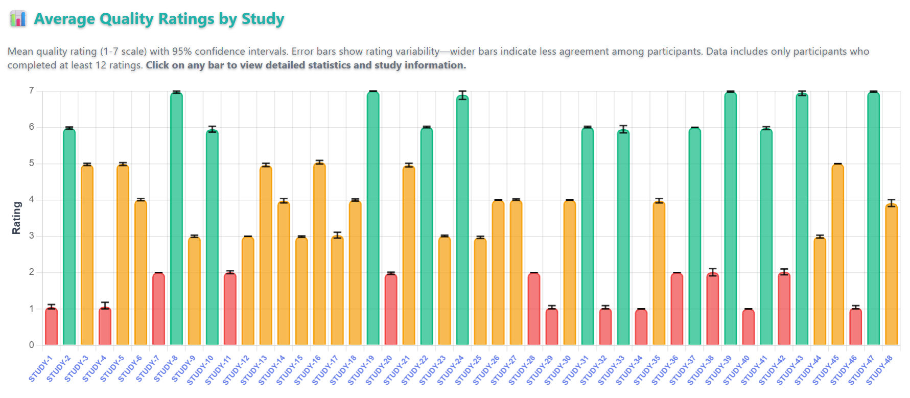

<a href='https://unlock-the-lab.web.app/' target='_blank'>
      <button style = "background-color: white; color: black; border: 2px solid #196F27; border-radius: 12px;">
      <h3 style = "margin-top: 7px !important; margin-left: 9px !important; margin-right: 9px !important;">
       Access web application
      </h3></button>
      </a>

 
 

Unlock the Lab is an educational web application designed to develop science literacy by guiding participants through the evaluation of research quality using evidence-based criteria. Rather than passively consuming information, participants actively engage with 48 fictional research scenarios, rating study quality and predicting how their peers will rate the same studies. This peer-anchored design fosters reflective thinking and helps participants calibrate their own judgements against a broader community standard.

The application is suitable for use in university workshops, open science training events, and self-directed learning. It requires no login or prior knowledge, and its browser-based format makes it accessible from any device.

<em>Welcome screen</em>

## Educational objectives

The app targets several interconnected competencies in scientific reasoning. Participants learn to:

- **Evaluate research quality** using a structured rubric that considers methodology, sample size, data transparency, pre-registration, and publication practices
- **Recognise misleading framing**, including sensationalised headlines and clickbait abstracts that misrepresent underlying findings
- **Identify barriers to knowledge access**, such as paywalled journals, predatory publishing, and the importance of open-access dissemination
- **Practise objective assessment** by decoupling conclusions from title framing and focusing on the evidence presented
- **Build calibrated consensus skills** by comparing personal ratings against the community average on each study

These objectives are embedded in both the educational content and the task design itself, so that learning occurs through doing rather than through instruction alone.

<em>Evaluation rubric presented before the study scenarios</em>

## Application structure

The workshop unfolds across three main phases:

1. **Educational introduction** — participants read background material on how to assess research, covering key concepts in study design, transparency, and publication ethics. A glossary of 21 scientific terms with accessible definitions is available throughout the activity and can be consulted at any point.
2. **Scenario evaluation** — participants work through 48 fictional research scenarios one at a time. For each study, they provide two ratings: a quality score (1–7 scale) and a prediction of the peer consensus score. The scenarios span a range of disciplines and vary in quality, methodology, and framing.
3. **Results and reflection** — after completing the scenarios, participants view their leaderboard position and can explore the live analytics dashboard to see how their ratings compare with the community.

<em>Example research scenario with dual rating interface</em>

## Scoring system

Performance is measured by prediction accuracy rather than by agreeing with any predetermined correct answer. Each study is scored as:

> **score = 100 − |predicted\_rating − actual\_peer\_average| × 12**

Scores are capped between 0 and 100. The aggregate score is the sum across all 48 studies, giving a maximum of 4800. This design rewards participants who understand how their peers reason about research quality, rather than those who simply hold strong opinions.

## Leaderboard

A real-time leaderboard ranks participants by their aggregate prediction score. Two views are available: the **top 200 of the last 24 hours** and the **all-time top 200**. Participants are identified by automatically assigned anonymous usernames (e.g., "Cheerful Penguin"), ensuring data privacy while still enabling a competitive and engaging ranking experience.

<em>Real-time leaderboard showing prediction accuracy rankings</em>

## Analytics dashboard

A publicly accessible live analytics dashboard provides visualisations of the aggregate data collected across all participants. The dashboard includes:

- **Overall rating distributions** for each study, showing the spread of quality scores
- **Participant statistics** such as the total number of completions and submission trends over time
- **Study-level metrics** including mean ratings and 95% confidence intervals, allowing comparison across scenarios

The dashboard is intended both for participants reviewing their own results and for facilitators and researchers interested in population-level patterns.

<em>Public analytics dashboard showing aggregate ratings with confidence intervals</em>

## Technology stack

| Layer | Technologies |
|---|---|
| Frontend | HTML5, CSS3, JavaScript (ES6+) |
| Visualisation | [Chart.js](https://www.chartjs.org/) 4.4.0 |
| Build tooling | [Vite](https://vite.dev/) 5.4 |
| Database | Firebase Realtime Database |
| Authentication | Firebase Authentication (anonymous) |
| Hosting | Firebase Hosting |

## Source code and contributions

The [source code is available on GitHub](https://github.com/pablobernabeu/Unlock_the_Lab) under a [Creative Commons Attribution 4.0 International](https://creativecommons.org/licenses/by/4.0/) licence. The application can be extended or adapted via pull requests. Feature requests, bug reports, and other suggestions can be submitted as [issues](https://github.com/pablobernabeu/Unlock_the_Lab/issues).
