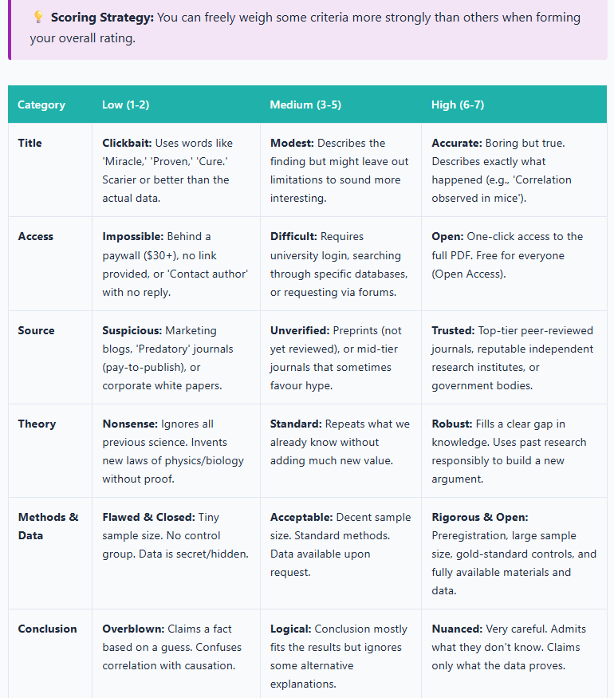
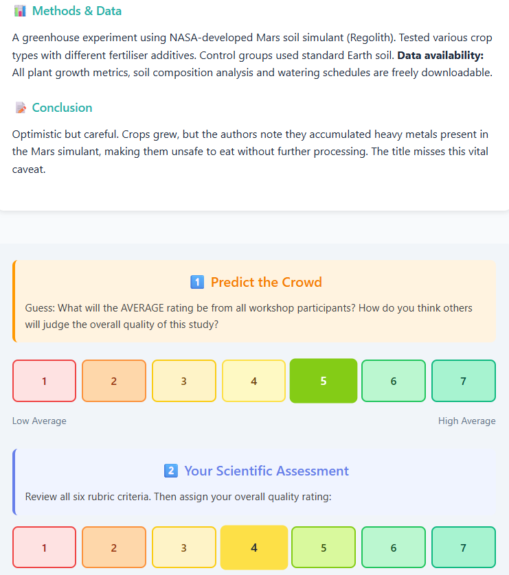
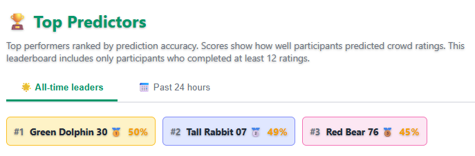
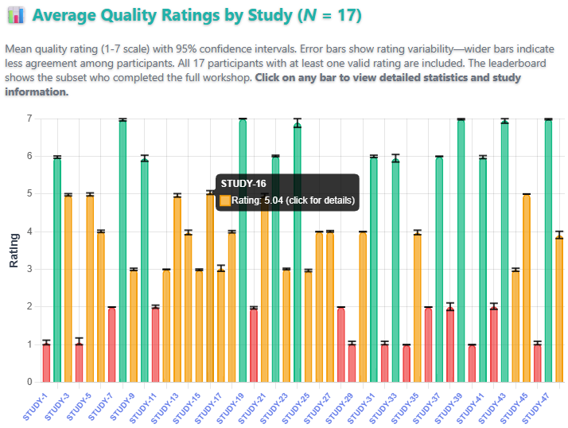

[**Unlock the Lab**](https://unlock-the-lab.web.app) is an educational web application designed to develop science literacy by guiding participants through the evaluation of research quality using evidence-based criteria. Rather than passively consuming information, participants actively engage with 48 fictional research scenarios, rating study quality and predicting how their peers will rate the same studies. This peer-anchored design fosters reflective thinking and helps participants calibrate their own judgements against a broader community standard.

The application is suitable for use in university workshops, open science training events and self-directed learning. It requires no login or prior knowledge, and its browser-based format makes it accessible from any device.

  <iframe src="https://unlock-the-lab.web.app"
      style="width: 100%; height: 100%; border: none;"
      title="Unlock the Lab web application">
  </iframe>

## Educational Objectives

The application targets several interconnected competencies in scientific reasoning. Participants learn to evaluate research quality using a structured rubric that covers methodology, sample size, data transparency, pre-registration, and publication practices. They also learn to recognise misleading framing, such as sensationalised headlines and clickbait abstracts that misrepresent underlying findings. The scenarios help users identify barriers to knowledge access, including paywalled journals and predatory publishing. A core objective is to practise objective assessment by decoupling conclusions from title framing and focusing instead on the evidence presented. Finally, participants build calibrated consensus skills by comparing their personal ratings against the community average for each study. These objectives are embedded in both the educational content and the task design, ensuring that learning occurs through active participation rather than passive instruction.

<em>Evaluation rubric presented before the study scenarios and accessible throughout the experience</em>

## Application Structure

The workshop unfolds across three main phases. The first is an **educational introduction** in which participants read background material on how to assess research, covering key concepts in study design, transparency and publication ethics. A glossary of 21 scientific terms with accessible definitions is available throughout and can be consulted at any point. The second phase is **scenario evaluation**: participants work through 48 fictional research scenarios one at a time, providing two ratings for each study on a 1–7 scale — a prediction of the peer consensus score followed by the participant's own rating. The scenarios span a range of disciplines and vary in quality, methodology and framing. The third phase, **results and reflection**, invites participants to view their leaderboard position and explore the [live analytics dashboard](https://unlock-the-lab.web.app/dashboard.html) to see how their ratings compare with the community as a whole.

<em>Example research scenario with dual rating interface</em>

## Scoring System

Performance is measured by prediction accuracy rather than by agreeing with any predetermined correct answer. Each study is scored as:

> **score = 100 − |predicted\_rating − actual\_peer\_average| × 12**

The multiplier of 12 is a deliberate design choice. Because ratings are on a 1–7 scale, the maximum possible error is 6. Multiplying by 12 means a worst-case prediction still yields a score of 28 (100 − 6 × 12), ensuring participants are never completely penalised for a single poor estimate. A harsher multiplier of roughly 17 would reduce a maximum-error prediction to zero; 12 was chosen as a more forgiving constant that keeps participants engaged throughout the task.

Scores are capped between 0 and 100. The aggregate score is the sum across all 48 studies, giving a maximum of 4800. This design rewards participants who understand how their peers reason about research quality, rather than those who simply hold strong opinions.

## Leaderboard

A real-time leaderboard ranks participants by their aggregate prediction score. Two views are available: the **top 200 of the last 24 hours** and the **all-time top 200**. Participants are identified by automatically assigned anonymous usernames (e.g., "Cheerful Penguin"), ensuring data privacy while still enabling a competitive and engaging ranking experience.

<em>Real-time leaderboard showing prediction accuracy rankings</em>

## Analytics Dashboard

A publicly accessible [live analytics dashboard](https://unlock-the-lab.web.app/dashboard.html) provides visualisations of the aggregate data collected across all participants. In addition to the leaderboard shown above, the dashboard includes a criterion importance chart showing the degree of importance that participants assigned to each evaluation criterion (title, access, source, theory, methods and data, and conclusion), and a study-level bar chart of mean quality ratings with 95% confidence intervals across all 48 studies. The dashboard is intended both for participants reviewing their own results and for facilitators and researchers interested in population-level patterns.

<em>Dashboard section showing the Criterion Importance chart, which displays the average token allocation per evaluation criterion across participants</em>

<em>Dashboard section showing mean quality ratings (1–7 scale) with 95% confidence intervals for each of the 48 studies; bars are colour-coded and clickable for detailed study information</em>

## Broader Themes for Discussion

The scenarios in Unlock the Lab are fictional, but the dynamics they expose are real. Several broader themes naturally arise when the application is used in a workshop or classroom setting.

A question that surfaces in most discussions of science communication is whether scientists are actually rewarded for communicating their work to non-specialist audiences — and the answer depends heavily on institutional context. In many academic systems, promotion and tenure are tied almost exclusively to publication metrics and grant income, leaving little professional incentive for scientists to invest in public engagement. Yet demand for accessible science has grown, particularly in the wake of high-profile controversies over vaccine safety, climate data and pandemic modelling. Some funders now require evidence of public engagement as a condition of grant awards, and frameworks such as the Research Excellence Framework in the United Kingdom have begun to recognise impact beyond academia. Despite these positive developments, a significant gap persists between the stated importance of public outreach and the professional rewards allocated to it.

Closely related to the question of outreach is a broader set of pressures that shape what research gets produced and how. The quantity and quality of research are governed by incentive structures operating at the level of individuals, institutions and journals. The pressure to publish frequently — sometimes described as publish-or-perish — has been associated with a range of questionable research practices, including selective reporting, inflated effect sizes and the suppression of null results in what is sometimes called the file-drawer problem. Journal impact factors, though widely criticised as crude proxies for article quality, continue to influence hiring and promotion decisions in ways that reward prestige over reproducibility. Funding bodies, which typically favour novelty over replication, have contributed to a research landscape in which confirmation is systematically undervalued. These pressures operate subtly: few researchers consciously intend to distort the scientific record, yet the cumulative effect of individually rational decisions can be a literature that overstates certainty and understates uncertainty. Recognising how these dynamics operate is itself a form of science literacy, and one that the evaluation scenarios in Unlock the Lab are designed to activate.

It is tempting to trace the open science movement to a gradual, principled awakening, but the reality is considerably less flattering. The push towards greater transparency in research did not emerge from idealism alone. Some of its most consequential catalysts were scandals. The case of Diederik Stapel, the Dutch social psychologist whose fabrication of data across dozens of studies was uncovered in 2011, became one of the most widely discussed episodes of scientific fraud in recent memory. Stapel had built a prolific career on results that were, in some cases, entirely invented, and his exposure prompted sustained reflection both about individual responsibility and about the structural conditions that had made long-term detection so difficult.

  

  <iframe src="https://www.youtube.com/embed/WUGh2VWR4JA" frameborder="0" allowfullscreen
      style="position: absolute; top: 0; left: 0; width: 100%; height: 100%;"></iframe>
  

The inquiries that followed identified several systemic vulnerabilities. The absence of raw data sharing, the reluctance of journals to publish replications and the deference that junior researchers typically accord senior colleagues all featured prominently. Similar cases — including those of Marc Hauser in evolutionary psychology, Dirk Smeesters in consumer behaviour and Jens Förster in social cognition — reinforced the argument that individual fraud was symptomatic of broader cultural problems in research. Out of this period of reckoning grew a set of reforms that are now, to varying degrees, embedded in scientific practice: pre-registration of hypotheses and analysis plans, open data and materials repositories, registered reports, large-scale replication efforts such as the Many Labs project, and the emergence of meta-scientific fields dedicated to studying science itself ([Bruton et al., 2020](https://doi.org/10.1007/s11948-020-00182-9); [Gopalakrishna et al., 2022](https://doi.org/10.1371/journal.pone.0263023); [Kepes et al., 2022](https://doi.org/10.1002/job.2623); [Larsson et al., 2023](https://doi.org/10.1016/j.rmal.2023.100064); [Makel et al., 2021](https://doi.org/10.3102/0013189X211001356); [Xie et al., 2021](https://doi.org/10.1007/s11948-021-00314-9)). These changes were not imposed from above alone; many were championed by researchers who recognised that the credibility of their own work depended on the credibility of the field as a whole.

Generative artificial intelligence has since added a further layer of complexity to these debates. The rapid uptake of large language models and other generative AI tools has introduced an entirely new set of questions about transparency and attribution in research. At the level of individual tasks, these tools can assist with drafting, literature synthesis, code generation and data analysis, offering genuine efficiency gains particularly for researchers working in their second or third language. At a systemic level, however, their integration into the research workflow raises concerns that overlap directly with the themes of Unlock the Lab. AI-generated text can produce plausible-sounding but inaccurate citations — a phenomenon sometimes called hallucination — and the persuasive fluency of generated prose can make methodological weaknesses harder to detect. Several journals now require explicit disclosure of AI use in submitted manuscripts, though policies vary widely and enforcement is difficult. Alongside these content-level concerns, large-scale bibliometric analysis of 41.3 million papers has revealed a structural paradox: scientists who engage in AI-augmented research publish more frequently and receive more citations, yet collective AI adoption narrows the range of scientific topics studied and reduces engagement among scientists, with AI-augmented work gravitating towards data-rich areas and appearing to automate established fields rather than pioneer new ones ([Hao et al., 2026](https://doi.org/10.1038/s41586-025-09922-y)). Perhaps most relevant to science communication is the question of trust: as AI lowers the cost of producing formally credible-looking content, the skills involved in evaluating sources, identifying clickbait and distinguishing rigorous research from superficially persuasive claims become more rather than less important.

## Technology Stack

| Layer | Technologies |
|---|---|
| Frontend | HTML5, CSS3, JavaScript (ES6+) |
| Visualisation | [Chart.js](https://www.chartjs.org/) 4.4.0 |
| Build tooling | [Vite](https://vite.dev/) 5.4 |
| Database | Firebase Realtime Database |
| Authentication | Firebase Authentication (anonymous) |
| Hosting | Firebase Hosting |

## Source Code and Contributions

The [source code is available on GitHub](https://github.com/pablobernabeu/Unlock_the_Lab) under a [Creative Commons Attribution 4.0 International](https://creativecommons.org/licenses/by/4.0/) licence. The application can be extended or adapted via pull requests. Feature requests, bug reports and other suggestions can be submitted as [issues](https://github.com/pablobernabeu/Unlock_the_Lab/issues).

## References

Bruton, S. V., Medlin, M., Brown, M., & Sacco, D. F. (2020). Personal motivations and systemic incentives: Scientists on questionable research practices. *Science and Engineering Ethics, 26*(3), 1531–1547. https://doi.org/10.1007/s11948-020-00182-9

Gopalakrishna, G., Ter Riet, G., Vink, G., Stoop, I., Wicherts, J. M., & Bouter, L. M. (2022). Prevalence of questionable research practices, research misconduct and their potential explanatory factors: A survey among academic researchers in The Netherlands. *PloS ONE, 17*(2), e0263023. https://doi.org/10.1371/journal.pone.0263023

Hao, Q., Xu, F., Li, Y., & Evans, J. (2026). Artificial intelligence tools expand scientists’ impact but contract science’s focus. *Nature, 679*, 1237–1243. https://doi.org/10.1038/s41586-025-09922-y

Kepes, S., Keener, S. K., McDaniel, M. A., & Hartman, N. S. (2022). Questionable research practices among researchers in the most research‐productive management programs. *Journal of Organizational Behavior, 43*(7), 1190–1208. https://doi.org/10.1002/job.2623

Larsson, T., Plonsky, L., Sterling, S., Kytö, M., Yaw, K., & Wood, M. (2023). On the frequency, prevalence, and perceived severity of questionable research practices. *Research Methods in Applied Linguistics, 2*(3), 100064. https://doi.org/10.1016/j.rmal.2023.100064

Makel, M. C., Hodges, J., Cook, B. G., & Plucker, J. A. (2021). Both questionable and open research practices are prevalent in education research. *Educational Researcher, 50*(8), 493–504. https://doi.org/10.3102/0013189X211001356

Xie, Y., Wang, K., & Kong, Y. (2021). Prevalence of research misconduct and questionable research practices: A systematic review and meta-analysis. *Science and Engineering Ethics, 27*(4), 41. https://doi.org/10.1007/s11948-021-00314-9

<a href='https://unlock-the-lab.web.app/' target='_blank' style="display:inline-block; margin-top: 0.8rem;">
      <button style = "background-color: white; color: black; border: 2px solid #196F27; border-radius: 12px;">
      <h3 style = "margin-top: 7px !important; margin-left: 9px !important; margin-right: 9px !important;">
       Access web application
      </h3></button>
      </a>
