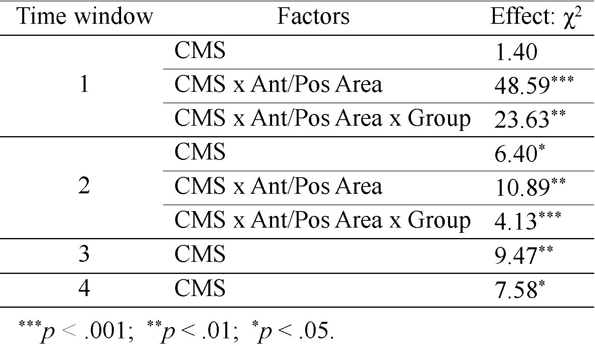

Research has extensively investigated whether conceptual processing is modality-specific—that is, whether meaning is processed to a large extent on the basis of perceptual and motor affordances (Barsalou, 2016). This possibility challenges long-established theories. It suggests a strong link between physical experience and language which is not borne out of the paradigmatic arbitrariness of words (see Lockwood, Dingemanse, & Hagoort, 2016). Modality-specificity also clashes with models of language that have no link to sensory and motor systems (Barsalou, 2016).

<a href='/publication/bernabeu-etal-2017/'>
      <button style = "background-color: white; color: black; border: 2px solid #4CAF50; border-radius: 12px;">
      <h3 style = "margin-top: 7px !important; margin-left: 9px !important; margin-right: 9px !important;"> 
       Conference paper </h3></button></a> &nbsp; 
      
<a href='/publication/bernabeu-2017-mphil-thesis/'>
      <button style = "background-color: white; color: black; border: 2px solid #196F27; border-radius: 12px;">
      <h3 style = "margin-top: 7px !important; margin-left: 9px !important; margin-right: 9px !important;"> 
       Master's thesis </h3></button></a> &nbsp; 
      
 
 

- [Early discussion on ResearchGate](https://www.researchgate.net/post/Conceptual_modality_switch_effect_measured_at_first_word)
- [Data and code](https://osf.io/97unm/)
- [Data dashboard](/applications-and-dashboards/bernabeu-etal-2017-modalityswitch/)

In the Conceptual Modality Switch (CMS) paradigm, participants perform a property verification task, deciding whether certain property words can reasonably describe concept words. Covertly, the conceptual modality of consecutive trials is manipulated in order to produce specific switches in conceptual modality. For instance, after the trial *Soundless Answer*, which is primarily auditory, the following trial may match in modality—*Loud Welcome*—or mismatch—*Fine Selection* (visual).

Modality switches incur processing costs, as reflected in brain signals linked to semantic violation, and in longer response times (RTs) (Scerrati, Lugli, Nicoletti, & Borghi, 2016). This effect suggests that perceptual features of concepts are accessed during conceptual processing. More recently, however, the CMS effect was reanalysed using a non-perceptual alternative. Louwerse and Connell (2011) found that language statistics (the co-occurrence of words in a language) were able to approximately predict visual/haptic, olfactory/gustatory, and auditory modalities, but not the subtler differences between visual and haptic and between olfactory and gustatory, which seemed to be reserved for perceptual simulations. Moreover, faster response times (RTs) were best explained by language statistics, whereas slower RTs were best explained by perceptual simulations.

The time course of word processing is important. Research suggests that word processing spans one second, during which different processes—semantic and post-semantic—gradually accumulate (Hauk, 2016). The later an effect, the more reasons to question it. Yet, having an early emergence does not either make an effect lexicosemantic, as the meaning encoded could have gone through working memory before activating the actual system of interest, e.g., sensorimotor (Mahon & Caramazza, 2008). Research also suggests that modal systems may contribute to conceptual processing early on—within 200 ms (Vukovic, Feurra, Shpektor, Myachykov, & Shtyrov, 2017). Thus, measuring effects online may prove valuable.

## Experiment

Bernabeu, Willems and Louwerse (2017) investigated whether CMS reflects a functionally relevant process of simulation or instead arises only after basic conceptual processing has been attained. We also examined whether different processing systems, amodal and modal, may compatibly operate.

We measured CMS online by time-locking Event-Related brain Potentials (ERPs) to the onset of the first word in the target trials, in order to assess how strongly CMS may be influenced by post-semantic processes. Previous research would predict an increase in the CMS effect over time because earlier processing is relatively amodal (Louwerse & Hutchinson, 2012).

We tested the compatibility of amodal and modal processing by drawing on Louwerse and Connell’s (2011) findings. In this conceptual replication, we split participants into a Quick and a Slow group based on RT. Maintaining CMS as a within-subjects factor, we predicted that the larger modality switches (e.g., auditory to visual) would be picked up equally by both groups, whereas the subtler switches (e.g., haptic to visual) would be picked up only—or more clearly—by the Slow group.

## Method

The stimuli were normed (Bernabeu, Louwerse, & Willems, in prep.). Three CMS conditions were created—Auditory-to-visual, Haptic-to-visual, Visual-to-visual—, each with 36 target trials. The property verification task was pretested valid (*N* = 19).

## Results

All participants but one responded correctly to over half of the trials, with an overall accuracy of 63%.

ERPs showed a CMS effect from time window 1 on, larger after 350 ms. It appeared with both switch conditions, and was characterized by a more negative amplitude for the switch conditions compared to the no-switch condition. It was generally stronger in the posterior brain regions, and in the Slow group. The results are illustrated in the figure below, which includes 95% Confidence Intervals and time windows.

The analysis was done with Linear Mixed Effects models. Final models presented good fits, with R2 ranging from .748 to .862. First, the CMS effect in time window 1 was confirmed significant. Such an early emergence is unprecedented in the CMS literature, and it may have been enabled by the time-locking of ERPs to the first word in target trials. In this time window, the only process not lexicosemantic is possibly working memory (Hauk, 2016), and therefore this early emergence adds support to the possibility that CMS was directly caused by perceptual simulation.

Whereas in time window 1, the effect was circumscribed to an interaction with Brain Area, by Time Window 2, a main effect of CMS emerged. In Windows 3 and 4, the only experimental effect was CMS.

Bonferroni-corrected, planned ANOVA contrasts into CMS conditions revealed that the no-switch condition differed significantly from the switch conditions. By contrast, the switch conditions (Haptic-to-visual and Auditory-to-visual) hardly differed from each other, underscoring the CMS effect.

Although the interaction of Group and CMS was only significant in Time Windows 1 and 2, Windows 2 to 4 presented a pattern fitting our predictions (Louwerse & Connell, 2011). While the Slow group picked up the switches across all modalities similarly, the Quick group picked up the Auditory-to-visual switch more clearly than the Haptic-to-visual switch.

### Statistical analysis

The statistical analysis is [available on OSF](https://osf.io/sx3nw) (to view the plots, please [download the document](https://osf.io/download/sx3nw)).

<iframe src="https://mfr.osf.io/render?url=https%3A%2F%2Fosf.io%2Fdownload%2Fsx3nw%2F%3Fdirect%26mode%3Drender"
        width="100%"
        scrolling="yes"
        height="677px"
        marginheight="0"
        frameborder="0"
        allowfullscreen
        webkitallowfullscreen
>
</iframe>

## Discussion

Results broadly suggest that cognition may operate on qualitatively different systems for the same task. In conceptual processing, one of these systems appears to be modality-independent, potentially based on linguistic co-occurrences, whereas another system is modality-specific, linked to physical experience.

A conference poster with further analyses is [also available](https://osf.io/dj52n).

## References

Barsalou, L. W. (2016). On staying grounded and avoiding quixotic dead ends. *Psychonomic Bulletin & Review, 23*.

Bernabeu, P., Louwerse, M. M., & Willems, R. M. (in prep.). Modality exclusivity norms for 747 properties and concepts in Dutch: a replication of English. Retrieved from https://osf.io/brkjw/

Bernabeu, P., Willems, R. M., & Louwerse, M. M. (2017). Modality switch effects emerge early and increase throughout conceptual processing: Evidence from ERPs. In G. Gunzelmann, A. Howes, T. Tenbrink, & E. J. Davelaar (Eds.), *Proceedings of the 39th Annual Conference of the Cognitive Science Society* (pp. 1629-1634). Austin, TX: Cognitive Science Society. https://doi.org/10.31234/osf.io/a5pcz

Hauk, O. (2016). Only time will tell—Why temporal information is essential for our neuroscientific understanding of semantics. *Psychonomic Bulletin & Review, 23*, 4, 1072-1079.

Lockwood, G., Hagoort, P., & Dingemanse, M. (2016). How iconicity helps people learn new words: neural correlates and individual differences in sound-symbolic bootstrapping. *Collabra, 2*, 1, 7.

Louwerse, M., & Connell, L. (2011). A taste of words: linguistic context and perceptual simulation predict the modality of words. *Cognitive Science, 35*, 2, 381-98.

Louwerse, M., & Hutchinson, S. (2012). Neurological evidence linguistic processes precede perceptual simulation in conceptual processing. *Frontiers in Psychology, 3*, 385.

Mahon, B. Z., & Caramazza, A. (2008). A critical look at the Embodied Cognition Hypothesis and a new proposal for grounding conceptual content. *Journal of Physiology - Paris, 102*, 59-70.

Scerrati, E., Lugli, L., Nicoletti, R., & Borghi, A. M. (2016). The Multilevel Modality-Switch Effect: What Happens When We See the Bees Buzzing and Hear the Diamonds Glistening. *Psychonomic Bulletin & Review*, doi:10.3758/s13423-016-1150-2.

Vukovic, V., Feurra, M., Shpektor, A., Myachykov, A., & Shtyrov, Y. (2017). Primary motor cortex functionally contributes to language comprehension: An online rTMS study. *Neuropsychologia, 96*, 222-229.

