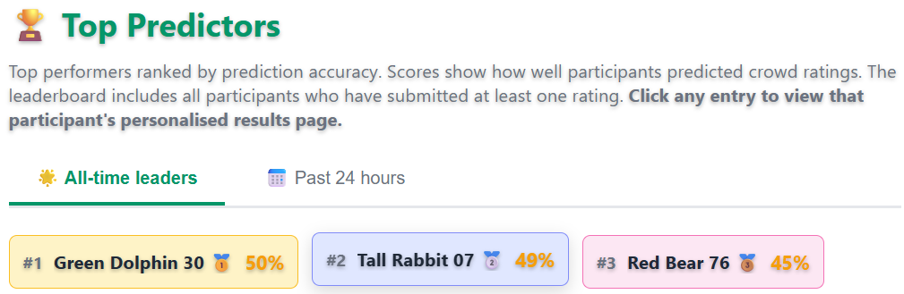
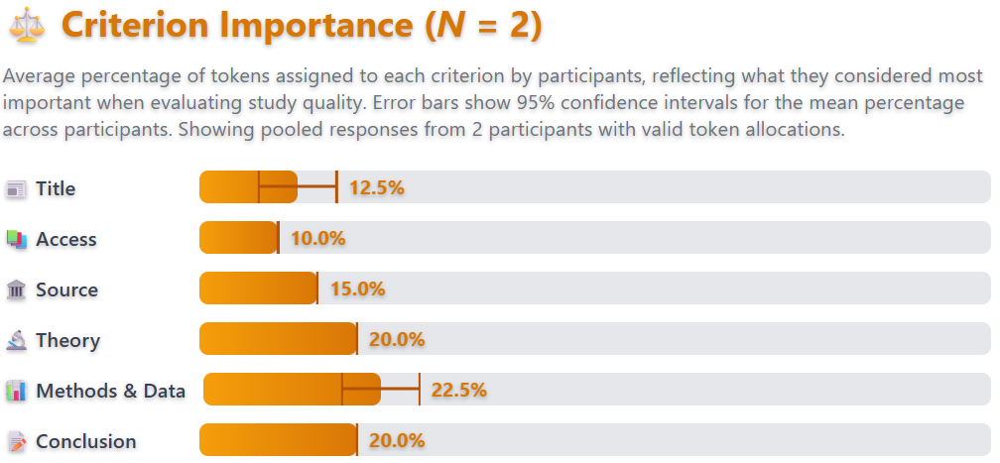
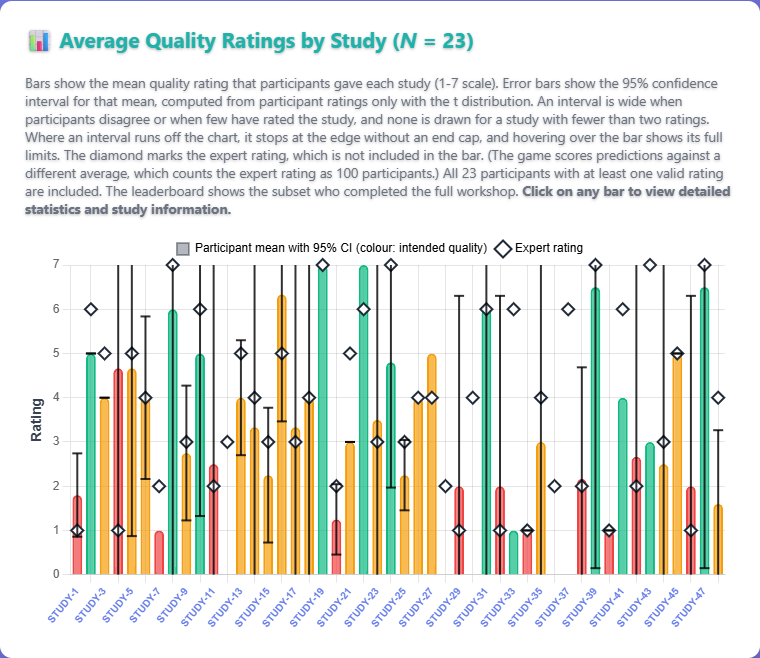

[**Unlock the Lab**](https://unlock-the-lab.web.app) is an educational web application that develops science literacy by guiding participants through the evaluation of research quality against evidence-based criteria. Participants work through 48 fictional research scenarios, rating the quality of each study and predicting how their peers will rate it. Anchoring the task to peer ratings encourages reflection and helps participants calibrate their judgements against those of a wider community.

The application is suitable for university workshops, open science training events and self-directed learning. It requires no login or prior knowledge, and it runs in the browser on any device.

  <iframe src="https://unlock-the-lab.web.app"
      style="width: 100%; height: 100%; border: none;"
      title="Unlock the Lab web application">
  </iframe>

### How it works

graph TD
  A["Educational introduction: assessment concepts and 21-term glossary"] --> B["Scenario evaluation: 48 fictional research scenarios"]
  B --> C["For each study, two ratings on a 1-7 scale"]
  C --> D["Predict peer consensus score"]
  C --> E["Give own quality rating"]
  D --> F["Score: 100 minus prediction error times 12"]
  F --> G["Results and reflection: leaderboard and analytics dashboard"]


## Educational objectives

The application targets several related skills in scientific reasoning. Participants learn to evaluate research quality with a rubric of six criteria, covering the title of a study, access to it, its source, its theory, its methods and data, and its conclusion. They also learn to recognise misleading framing, such as sensationalised headlines and clickbait abstracts that misrepresent the findings, and to identify barriers to accessing knowledge, including paywalls and predatory publishing. A core objective is to judge each study on the evidence it presents, whatever the framing of its title. Finally, participants calibrate their judgements by comparing their own ratings with the community average for each study. These objectives are built into both the educational content and the design of the task, so that participants learn by taking part.

<em>The evaluation rubric, presented before the study scenarios and available throughout</em>

## Application structure

The workshop unfolds in three phases. The first is an educational introduction in which participants read background material on how to assess research, covering key concepts in study design, transparency and publication ethics. A glossary of 21 scientific terms with accessible definitions can be consulted at any point. In the second phase, participants evaluate the 48 fictional research scenarios one at a time. For each study, they first predict the peer consensus rating on a 1–7 scale and then give their own rating. The scenarios span a range of disciplines and vary in quality, methodology and framing. In the third phase, participants distribute 20 tokens across the six rubric criteria according to how much each one mattered to them. They can then view their position on the leaderboard and explore the [live analytics dashboard](https://unlock-the-lab.web.app/dashboard.html) to see how their ratings compare with those of the community as a whole.

<em>Example research scenario with dual rating interface</em>

## Scoring system

Performance is measured by how accurately participants predict the peer consensus. Each study is scored as follows:

> **score = 100 − |predicted\_rating − actual\_peer\_average| × 12**

The peer average of each study also counts an expert rating as if 100 participants had given it, so this rating still carries half the weight once 100 participants have rated the study.

Because ratings are on a 1–7 scale, the largest possible error is 6, so even the worst prediction scores 28 (100 − 6 × 12). A multiplier of about 17 would bring that score down to zero. The more forgiving multiplier of 12 ensures that no single poor estimate is penalised completely, and this helps to keep participants engaged throughout the task.

The aggregate score is the sum across the studies rated, up to a maximum of 4,800 for all 48. The design thus rewards participants for understanding how their peers reason about research quality.

## Leaderboard

A real-time leaderboard ranks participants by their aggregate prediction score, with one view for the top 200 of the last 24 hours and another for the all-time top 200. Participants appear under automatically assigned anonymous usernames (e.g., "Cheerful Penguin 42"), so the ranking stays competitive without revealing anyone's identity.

<em>Real-time leaderboard showing prediction accuracy rankings</em>

## Analytics dashboard

A public [live analytics dashboard](https://unlock-the-lab.web.app/dashboard.html) visualises the data aggregated across all participants. Besides the leaderboard described above, it includes a criterion importance chart showing the share of tokens that participants assigned to each of the six rubric criteria. A bar chart also shows the mean quality rating of each of the 48 studies, with 95% confidence intervals. As in the scoring, these means and confidence intervals include the weighted expert rating of each study. The dashboard serves both participants reviewing their own results and facilitators or researchers interested in patterns across the whole group.

<em>The criterion importance chart, showing the average share of tokens that participants allocated to each evaluation criterion</em>

<em>Mean quality ratings (1–7 scale) with 95% confidence intervals for each of the 48 studies. Clicking a colour-coded bar opens detailed information on the study.</em>

## Broader themes for discussion

The scenarios in Unlock the Lab are fictional, but the dynamics they expose are real, and several broader themes tend to arise when the application is used in a workshop or classroom.

Most discussions of science communication raise the question of whether scientists are rewarded for communicating their work to non-specialist audiences. The answer depends heavily on the institutional context. In many academic systems, promotion and tenure are tied almost exclusively to publication metrics and grant income, which leaves scientists little professional incentive to invest in public engagement. Yet demand for accessible science has grown, particularly after high-profile controversies over vaccine safety, climate data and pandemic modelling. Some funders now require evidence of public engagement as a condition of their grants, and assessment frameworks such as the Research Excellence Framework in the United Kingdom recognise impact beyond academia. Even so, a wide gap persists between the stated importance of public outreach and the professional rewards it brings.

Closely related to the question of outreach is a broader set of pressures that shape what research is produced and how. Incentives acting on individuals, institutions and journals govern both the quantity and the quality of research. The pressure to publish frequently, often summed up as 'publish or perish', has been associated with a range of questionable research practices. These include selective reporting, inflated effect sizes and the suppression of null results, known as the file-drawer problem. Journal impact factors, though widely criticised as crude proxies for the quality of an article, still influence hiring and promotion in ways that reward prestige over reproducibility. Funding bodies, which typically favour novelty over replication, have contributed to a research landscape that systematically undervalues confirmation. These pressures operate subtly. Few researchers consciously intend to distort the scientific record, yet the cumulative effect of individually rational decisions can be a literature that overstates certainty. Recognising these dynamics is itself a form of science literacy, and the evaluation scenarios in Unlock the Lab are designed to exercise it.

It is tempting to see the open science movement as a gradual, idealistic awakening, but the reality is less flattering, as some of its strongest catalysts were scandals. The case of Diederik Stapel, the Dutch social psychologist whose fabrication of data across dozens of studies was uncovered in 2011, became one of the most widely discussed episodes of scientific fraud in recent memory. Stapel had built a prolific career on results that were, in some cases, entirely invented. His exposure prompted sustained reflection on individual responsibility and on the structural conditions that had allowed the fraud to go undetected for so long. During the TEDx Braintrain in 2013, Stapel gave a talk in English about his downfall, and Omroep Brabant published the recording below.

  

  <iframe title="Video: Diederik Stapel's talk on the TEDx Braintrain (Omroep Brabant)" src="https://www.youtube.com/embed/WUGh2VWR4JA" frameborder="0" allowfullscreen
      style="position: absolute; top: 0; left: 0; width: 100%; height: 100%;"></iframe>
  

The inquiries that followed identified several systemic weaknesses, among them the absence of raw data sharing, the reluctance of journals to publish replications and the deference that junior researchers typically show senior colleagues. Similar cases, including those of Marc Hauser in evolutionary psychology, Dirk Smeesters in consumer behaviour and Jens Förster in social cognition, reinforced the argument that individual fraud was a symptom of broader cultural problems in research. Out of this period of reckoning grew reforms that are now, to varying degrees, part of scientific practice. They include the pre-registration of hypotheses and analysis plans, repositories for open data and materials, registered reports, and large-scale replication efforts such as the Many Labs project. Meta-science, the study of how research itself is conducted, also grew into a field of its own. Its studies continue to document how common questionable research practices are and the incentives that sustain them ([Bruton et al., 2020](https://doi.org/10.1007/s11948-020-00182-9); [Gopalakrishna et al., 2022](https://doi.org/10.1371/journal.pone.0263023); [Kepes et al., 2022](https://doi.org/10.1002/job.2623); [Larsson et al., 2023](https://doi.org/10.1016/j.rmal.2023.100064); [Makel et al., 2021](https://doi.org/10.3102/0013189X211001356); [Xie et al., 2021](https://doi.org/10.1007/s11948-021-00314-9)). Many of these reforms were championed by researchers who recognised that the credibility of their own work depended on the credibility of their field.

Generative artificial intelligence (AI) has since added a further layer of complexity to these debates. The rapid uptake of large language models and other generative tools has raised new questions about transparency and attribution in research. For individual tasks, these tools can assist with drafting, literature synthesis, code generation and data analysis, and they can make this work more efficient, particularly for researchers working in their second or third language. At a systemic level, however, their use in research raises concerns that overlap directly with the themes of Unlock the Lab. AI-generated text can include plausible but inaccurate citations, a phenomenon known as hallucination, and the fluency of generated prose can make methodological weaknesses harder to detect. Several journals now require authors to disclose the use of AI in their manuscripts, though policies vary widely and are difficult to enforce.

At a larger scale, [Hao et al. (2026)](https://doi.org/10.1038/s41586-025-09922-y) analysed 41.3 million papers in the natural sciences and found a paradox. Scientists who engage in AI-augmented research publish more papers and receive more citations, yet the adoption of AI narrows the collective range of topics studied and reduces scientists' engagement with one another. As AI-augmented work moves towards the areas richest in data, AI tools seem to automate established fields rather than explore new ones. For science communication, the most pressing question may be one of trust. As AI lowers the cost of producing content that looks credible, the skills of evaluating sources, spotting clickbait and distinguishing rigorous research from superficially persuasive claims become all the more important.

## Source code and contributions

The application is written in HTML, CSS and JavaScript. Its charts are drawn with [Chart.js](https://www.chartjs.org/), and Firebase provides the real-time database and the anonymous authentication of participants. The [source code is available on GitHub](https://github.com/pablobernabeu/Unlock_the_Lab) under a [Creative Commons Attribution 4.0 International](https://creativecommons.org/licenses/by/4.0/) licence and archived on Zenodo ([Bernabeu, 2026](https://doi.org/10.5281/zenodo.19153148)). The application can be extended or adapted through pull requests. Feature requests, bug reports and other suggestions can be submitted as [issues](https://github.com/pablobernabeu/Unlock_the_Lab/issues).

## References

Bernabeu, P. (2026). *Unlock the Lab: Your guide to reading science like a scientist* (Version 1.0.0) [Computer software]. Zenodo. https://doi.org/10.5281/zenodo.19153148

Bruton, S. V., Medlin, M., Brown, M., & Sacco, D. F. (2020). Personal motivations and systemic incentives: Scientists on questionable research practices. *Science and Engineering Ethics, 26*(3), 1531–1547. https://doi.org/10.1007/s11948-020-00182-9

Gopalakrishna, G., ter Riet, G., Vink, G., Stoop, I., Wicherts, J. M., & Bouter, L. M. (2022). Prevalence of questionable research practices, research misconduct and their potential explanatory factors: A survey among academic researchers in The Netherlands. *PLOS ONE, 17*(2), e0263023. https://doi.org/10.1371/journal.pone.0263023

Hao, Q., Xu, F., Li, Y., & Evans, J. (2026). Artificial intelligence tools expand scientists’ impact but contract science’s focus. *Nature, 649*(8099), 1237–1243. https://doi.org/10.1038/s41586-025-09922-y

Kepes, S., Keener, S. K., McDaniel, M. A., & Hartman, N. S. (2022). Questionable research practices among researchers in the most research-productive management programs. *Journal of Organizational Behavior, 43*(7), 1190–1208. https://doi.org/10.1002/job.2623

Larsson, T., Plonsky, L., Sterling, S., Kytö, M., Yaw, K., & Wood, M. (2023). On the frequency, prevalence, and perceived severity of questionable research practices. *Research Methods in Applied Linguistics, 2*(3), 100064. https://doi.org/10.1016/j.rmal.2023.100064

Makel, M. C., Hodges, J., Cook, B. G., & Plucker, J. A. (2021). Both questionable and open research practices are prevalent in education research. *Educational Researcher, 50*(8), 493–504. https://doi.org/10.3102/0013189X211001356

Xie, Y., Wang, K., & Kong, Y. (2021). Prevalence of research misconduct and questionable research practices: A systematic review and meta-analysis. *Science and Engineering Ethics, 27*(4), 41. https://doi.org/10.1007/s11948-021-00314-9

<a href='https://unlock-the-lab.web.app/' target='_blank' style="display:inline-block; margin-top: 0.8rem;">
      <button style = "background-color: white; color: black; border: 2px solid #196F27; border-radius: 12px;">
      <h3 style = "margin-top: 7px !important; margin-left: 9px !important; margin-right: 9px !important;">
       Access web application
      </h3></button>
      </a>
