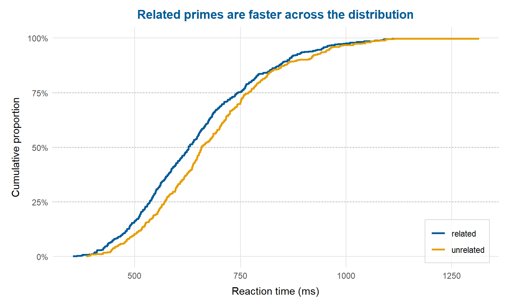
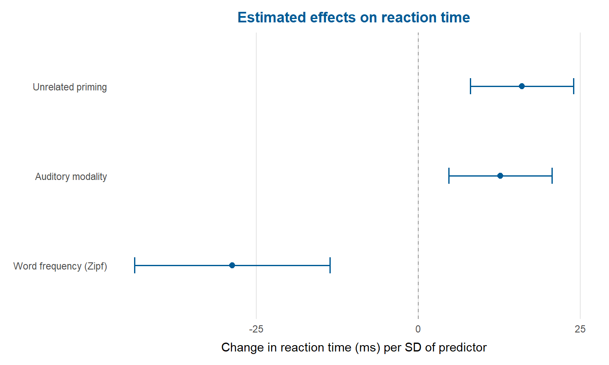
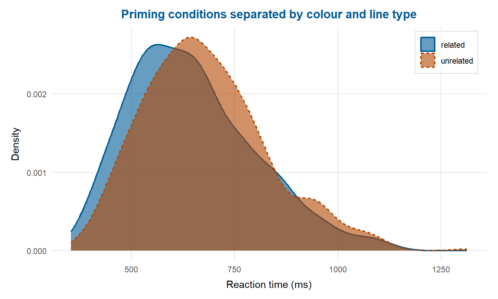

## Overview

depictr (Bernabeu, 2026) provides a shared visual language for exploratory graphics, model estimates, diagnostics, uncertainty and power analyses. Its R and Python implementations use the same naming and colour conventions, and both return ordinary plot objects that can still be adapted to the needs of a study. The accessibility audit examines the rendered figure itself, since a colourblind-aware palette alone cannot guarantee an accessible figure.

The Python implementation also has a Streamlit app, which offers a gallery of the plots and a way to try the package without writing any code. It runs locally from a clone of the [Python repository](https://github.com/pablobernabeu/depictr-py), as the [app guide](https://pablobernabeu.github.io/depictr-py/app/) explains.

## One Set of Conventions, Audited at the End

Colour, interval and labelling conventions carry from the observed distribution of a simulated lexical-decision experiment, through the model estimates, to the figure that will leave the project. Figure 1 shows the observed distributions, Figure 2 the model estimates drawn from the same data, and Figure 3 the version that the accessibility audit asked for.

<figure>

<figcaption>Observed Reaction-Time Distributions With Directly Readable Quartiles.</figcaption>
</figure>

<figure>

<figcaption>Fixed Effects in Milliseconds per Standard Deviation of the Predictor, With 95% Confidence Intervals.</figcaption>
</figure>

<figure>

<figcaption>The Corrected Figure, in Which Colour and Line Type Both Separate the Priming Conditions.</figcaption>
</figure>

## Reproducibility and Accessibility

The recommended workflow is to keep the plotting code with the analysis, record the package version and run the audit on the exact figure that will be submitted or presented. Alt text and a meaningful caption remain part of the author's editorial responsibility. See the [R documentation](https://pablobernabeu.github.io/depictr/), [Python documentation](https://pablobernabeu.github.io/depictr-py/) and [companion blog post](/2026/depictr-one-visual-language-from-first-look-to-final-figure/) for runnable examples.

## Reference

Bernabeu, P. (2026). *depictr: A unified toolkit for visualising statistical models and data* (Version 0.3.0) [Computer software]. CRAN. https://doi.org/10.32614/CRAN.package.depictr
