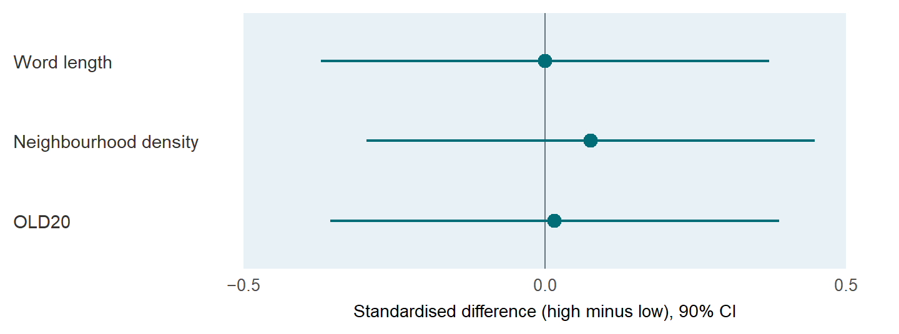

## Overview

lexsync (Bernabeu, 2026) turns a lexical design into a checked set of stimuli and experiment files. It separates the candidate corpus from the design specification, reports whether matching and counterbalancing succeeded, and carries the resulting item table into PsychoPy, OpenSesame or jsPsych. The shared R/Python format makes the design inspectable before any presentation software is involved.

## Illustrative output

The main quality-control question for a set of lexical materials is whether the conditions remain comparable on the control variables chosen by the researcher. The plot below comes from the matching report in the companion blog post. It shows the standardised difference between the low- and high-frequency conditions on each control, with a 90 per cent confidence interval and a prespecified equivalence region.

<figure>

<figcaption>Realised balance between the frequency conditions on the control variables.</figcaption>
</figure>

## Reproducible hand-off

Save the design, the source lexicon, the matching report and the generated experiment together. Before recording EEG, verify the exported timing, trigger codes, trial order and counterbalancing in the target presentation framework. The [R documentation](https://pablobernabeu.github.io/lexsync/r/), [Python documentation](https://pablobernabeu.github.io/lexsync/python/) and [companion blog post](/2026/lexsync-from-corpus-to-eeg-ready-experiment/) provide the complete workflow.

## Reference

Bernabeu, P. (2026). *lexsync: Lexical optimisation and hardware-timed experiment generation* (Version 0.1.0) [Computer software]. GitHub. https://github.com/pablobernabeu/lexsync
