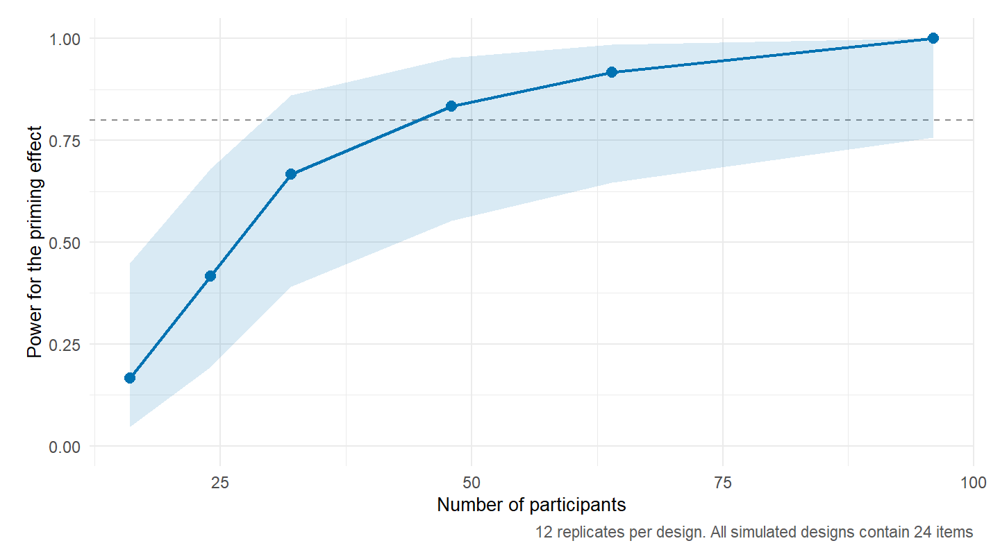
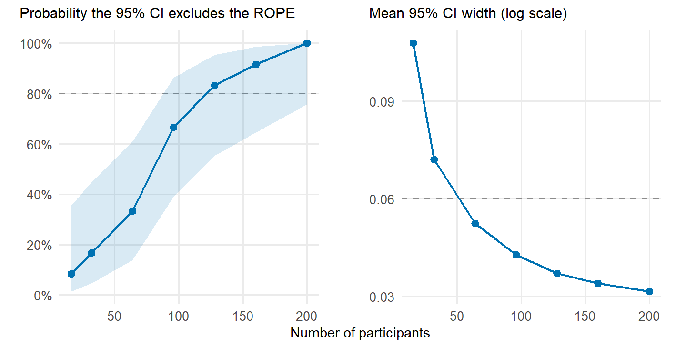
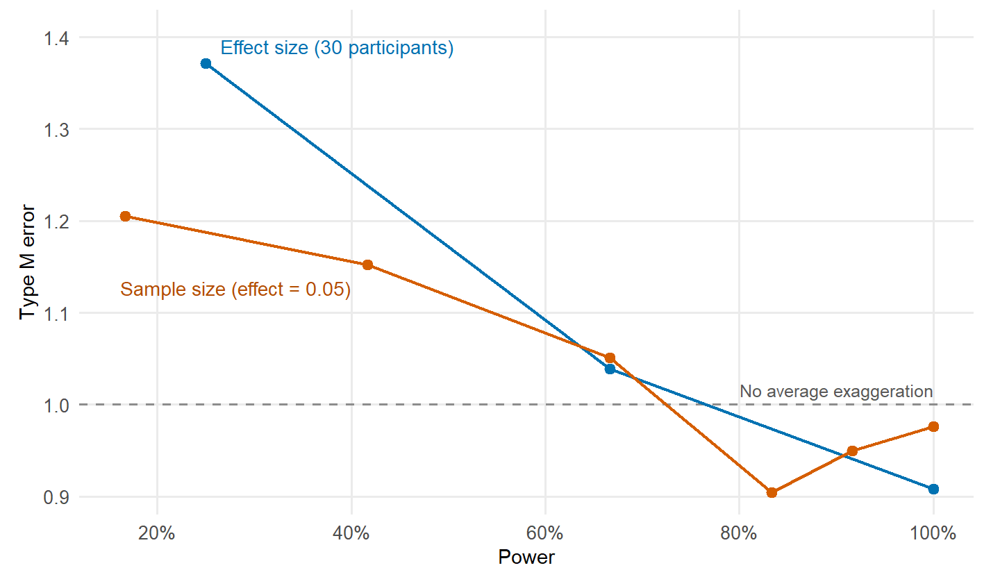

## Overview

pilotr (Bernabeu, 2026) makes a planned study executable before any data are collected. A portable specification describes the units, predictors, response family, fixed effects and random-effects structure, and the same specification can then be simulated and analysed in R or Python. The main output is a design diagnosis that goes beyond a single power percentage to cover detection, precision, Type S and Type M errors, and model warnings.

## Illustrative outputs

A simulation-based design analysis should establish how often the target effect is detected, how precisely it is estimated and how much the statistically significant estimates exaggerate it. The plots below address each of these questions in turn.

<figure>

<figcaption>Detection probability across participant counts.</figcaption>
</figure>

<figure>

<figcaption>Precision and the probability that an interval excludes a pre-specified negligible-effect region.</figcaption>
</figure>

<figure>

<figcaption>Magnitude exaggeration among statistically significant estimates.</figcaption>
</figure>

## Reproducible planning

Treat the specification, simulation seed, package version, number of replicates and fitted model as part of the planning record. The [companion blog post](/2026/pilotr-pilot-the-study-before-running-it/) keeps its examples quick by running each analysis with a small number of replicates. A real design decision requires many more replicates and a sensitivity analysis over plausible assumptions. The [R documentation](https://pablobernabeu.github.io/pilotr/r/), [Python documentation](https://pablobernabeu.github.io/pilotr/python/) and [browser app](https://pablobernabeu.github.io/pilotr/app/) cover the full workflow.

## Reference

Bernabeu, P. (2026). *pilotr: Simulate experimental and behavioural data from a portable design specification* (Version 0.3.0) [Computer software]. CRAN. https://doi.org/10.32614/CRAN.package.pilotr
