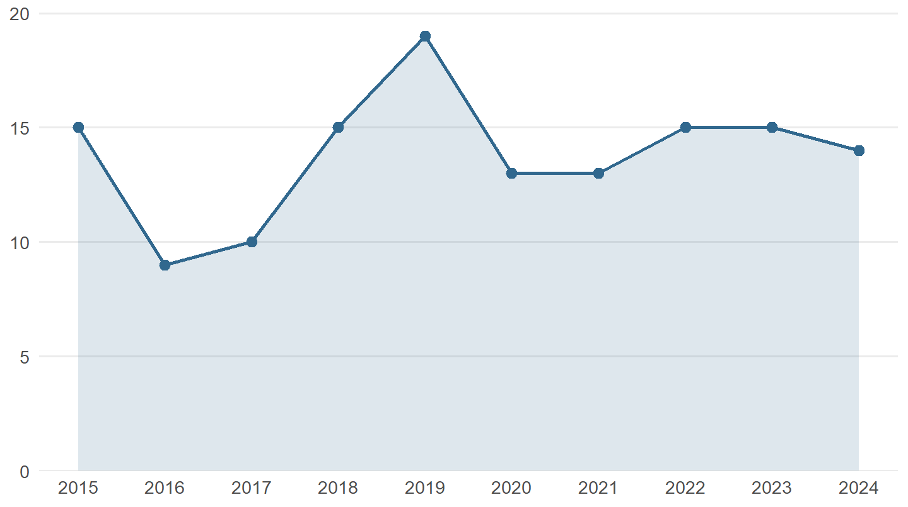

## Overview

scopusflow (Bernabeu, 2026) turns a bibliographic search from a one-off export into a versioned workflow. A plan records the query and can divide it into yearly cells. Completed cells can be cached so that an interrupted retrieval resumes where it stopped, and the resulting object retains the retrieval metadata, package version and DOI-level changes. The R and Python packages use the same workflow concepts while respecting the access and redistribution limits of the source database.

## Illustrative output

The example below uses a small demonstration corpus bundled with the R package, so the plot illustrates the workflow and says nothing about the Scopus literature on the topic.

<figure>

<figcaption>A trend plot drawn from the offline demonstration corpus, without an API key.</figcaption>
</figure>

## Reproducible reporting

Keep the plan, cache manifest, native result object, DOI comparison and generated PRISMA-S record under version control. A future update can then distinguish a change in the literature from a change in the query, database coverage or retrieval process. Read the [R documentation](https://pablobernabeu.github.io/scopusflow/), [Python documentation](https://pablobernabeu.github.io/scopusflow-py/) and [companion blog post](/2026/scopusflow-a-literature-search-you-can-rerun/) for the offline and authenticated workflows.

## Reference

Bernabeu, P. (2026). *scopusflow: A reproducible workflow layer for Scopus bibliographic searches* (Version 0.4.0) [Computer software]. CRAN. https://doi.org/10.32614/CRAN.package.scopusflow
