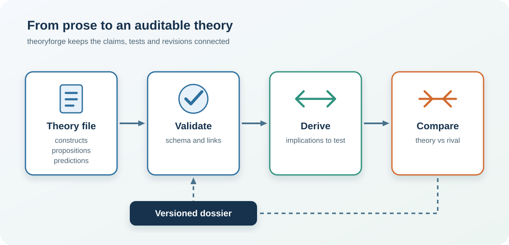

## Overview

theoryforge represents a scientific theory as a versioned, machine-checkable document. Constructs, propositions, predictions, alternatives and provenance are linked by identifiers, so the package can validate the specification, derive implications, compare amendments and export a reviewable dossier. The checks describe the completeness and internal coherence of a specification; they do not establish that the theory is true.

## Illustrative workflow

The workflow makes the path from a theory file to a discriminating test explicit.

<figure>

<figcaption>From structured claims to an auditable theory dossier.</figcaption>
</figure>

## Reproducible theory development

Store the theory document, schema version, validation report, derived implications, data-generating assumptions and checksum together. The [R documentation](https://pablobernabeu.github.io/theoryforge/r/), [Python documentation](https://pablobernabeu.github.io/theoryforge/python/), [browser apps](https://pablobernabeu.github.io/theoryforge/) and [companion blog post](/2026/theoryforge-a-theory-you-can-check/) show how the same specification supports formalisation, testing and preregistration.

## Reference

Bernabeu, P. (2026). *theoryforge: Systematic theory development* (Version 0.6.0) [Computer software]. CRAN. https://doi.org/10.32614/CRAN.package.theoryforge
